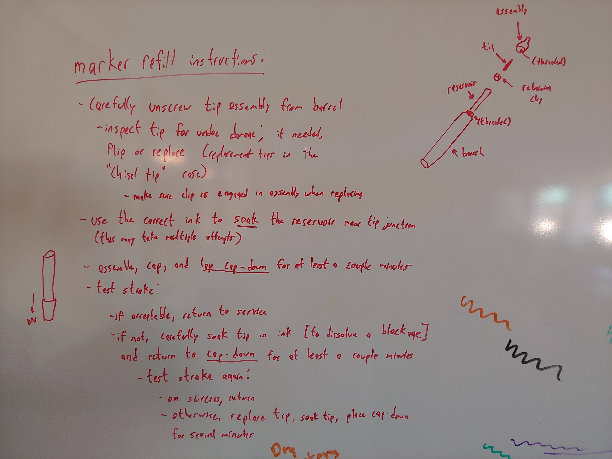

# Markers

## Marker Refill Instructions

- Carefully unscrew tip assembly from barrel
  - Inspect tip for damage. If needed, flip or replace the tip.
	- Replacement tips can be found in the marker cases on the green bookshelf in the front of the lab.
	- make sure that the tip clips into place when being inserted.

- Use the correct into the soak the reservoir inside of the barrel
  - Usually takes around 20-25 drops.

- Reassemble the marker, put the cap on it, and stand the marker vertically on the cap for a couple minutes to allow ink to soak back into the tip.

- Test the marker to make sure that it works
```cpp
while (true) {
	if (marker_works) {
		return to_service;
	}
	else {
		soak_tip_in_ink();
		place_cap_down("5 minutes");
	}
}
```


