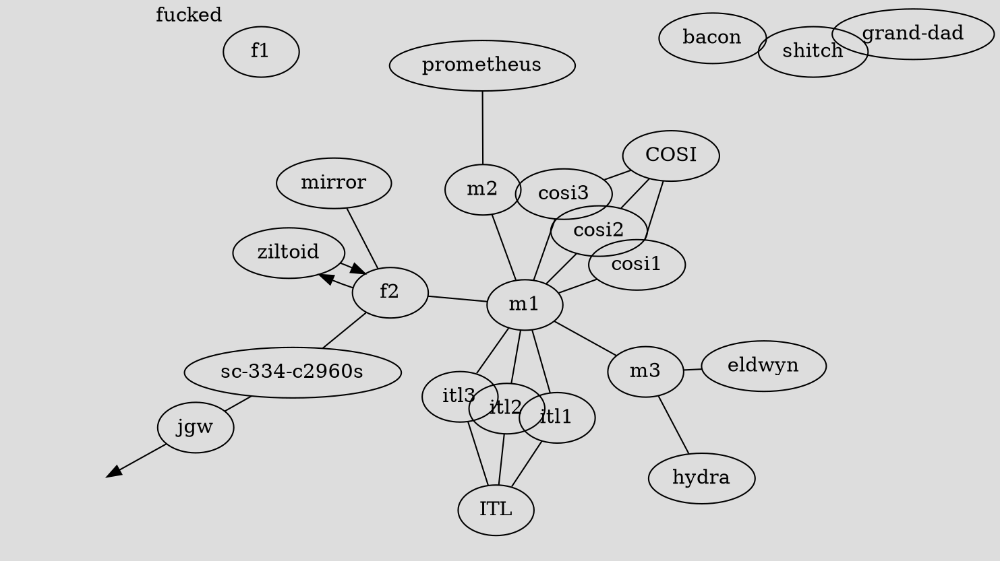
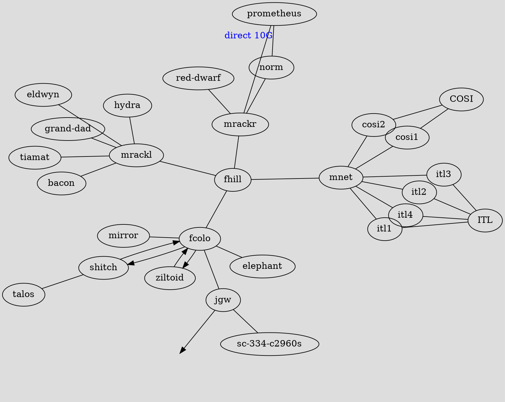

# Topology

*Last Updated: 2023-01-04*

```dot process
/* COSI network topology
 *
 * Some things to keep in mind:
 * - Filenames must be both in the repo root (so `graphviz` itself sees them)
 *   and in the same directory (so they're hosted from the right place in the
 *   built book). The easiest way to do this is a symlink.
 * - The edge orientation is "tail -- head". `headlabel` and `taillabel` are
 *   powerful tools.
 */

graph {
	layout="neato";
	bgcolor="#dddddd";
	
	/* Nodes */
	internet [shape=none,height=1,width=1,fixedsize=true,image="cloud.gif",label=""];
	jgw [class="clarkson"];
	sc334 [class="clarkson",label="sc-334-c2960s"];
	f1 [class="agg",xlabel="fucked"];
	f2 [class="agg"];
	mirror [class="host"];
	ziltoid [class="host"];
	m1 [class="managed"];
	m2 [class="managed"];
	m3 [class="managed"];
	bacon [class="host"];
	"grand-dad" [class="host"];
	itl1;
	itl2;
	itl3;
	cosi1;
	cosi2;
	cosi3;
	eldwyn [class="host"];
	hydra [class="host"];
	prometheus [class="host"];
	shitch;
	COSI [class="room"];
	ITL [class="room"];
	
	/* Edges */
	internet -- jgw[dir=back,len=1.5,class="clarkson"];
	jgw -- sc334 [class="clarkson"];
	
	sc334 -- f2 -- mirror [class="smf"];
	// these are separate ports, to be labeled
	f2 -- ziltoid [dir=forward,class="smf"];
	f2 -- ziltoid [dir=back,class="smf"];
	f2 -- m1 -- m2;
	m1 -- m3;
	m1 -- {cosi1, cosi2, cosi3, itl1, itl2, itl3};
	{cosi1, cosi2, cosi3} -- COSI [class="room"];
	{itl1, itl2, itl3} -- ITL [class="room"];
	m3 -- {eldwyn, hydra};
	m2 -- prometheus;
	shitch -- {bacon, "grand-dad"};
}
```

## Desired Topology

```dot process
graph {
	layout="neato";
	bgcolor="#dddddd";
	ratio=0.75;
	
	/* Nodes */
	internet [shape=none,height=1,width=1,fixedsize=true,image="cloud.gif",label=""];
	jgw [class="clarkson"];
	sc334 [class="clarkson",label="sc-334-c2960s"];
	fcolo [class="agg"];
	fhill [class="agg"];
	mirror [class="host"];
	ziltoid [class="host"];
	mnet [class="managed"];
	mrackl [class="managed"];
	mrackr [class="managed"];
	bacon [class="host",href="../servers/bacon.html"];
	"grand-dad" [class="host"];
	subgraph itl {
		itl1; itl2; itl3; itl4;
	}
	subgraph cosi {
		cosi1; cosi2;
	}
	eldwyn [class="host",href="../servers/eldwyn.html"];
	hydra [class="host",href="../servers/hydra.html"];
	prometheus [class="host"];
	shitch;
	COSI [class="room"];
	ITL [class="room"];
	ziltoid [class="host",href="../servers/ziltoid.html"];
	talos [class="host",href="../servers/talos.html"];
	elephant [class="host",href="../servers/elephant.html"];
	norm [class="host"];
	"red-dwarf" [class="host"];
	tiamat [class="host",href="../servers/tiamat.html"];
	
	/* Edges */
	internet -- jgw[dir=back,len=1.5,class="clarkson"];
	jgw -- sc334 [class="clarkson"];
	
	// these are separate ports, to be labeled
	fcolo -- fhill [class="smf40"];
	fhill -- {mnet, mrackl, mrackr} [class="smf10"];
	mnet -- {itl1, itl2, itl3, itl4, cosi1, cosi2};
	mrackr -- {norm, "red-dwarf"};
	mrackr -- prometheus [len=2.0];
	mrackl -- "grand-dad";
	mrackl -- eldwyn [len=1.25];
	mrackl -- {tiamat, bacon, hydra} [class="smf10"];
	{cosi1, cosi2} -- COSI [class="room"];
	{itl1, itl2, itl3, itl4} -- ITL [class="room"];
	shitch -- talos;
	fcolo -- elephant [class="smf10"];
	fcolo -- mirror [class="smf10"];
	fcolo -- jgw [class="smf10"];
	fcolo -- shitch [dir=forward];
	fcolo -- shitch [dir=back];
	fcolo -- ziltoid [dir=forward,class="smf10"];
	fcolo -- ziltoid [dir=back,class="smf10"];
	norm -- prometheus [class="e10g",label="direct 10G",fontcolor="blue",labelangle=-180];
}
```
