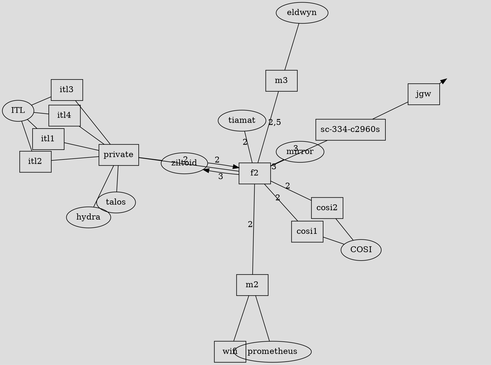
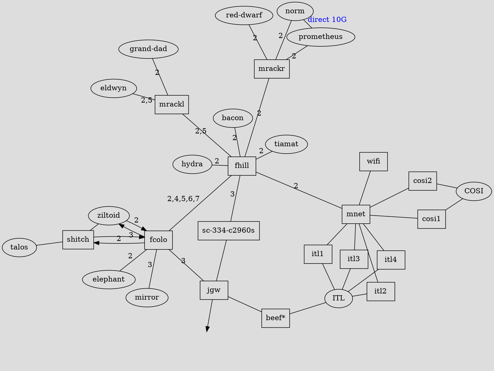

# Topology

_updated: Jan 15th 2023_

**Legend: Edges**

| Style  | Description                   |
|--------|-------------------------------|
| Red    | 40 gigabit single mode fiber  |
| Orange | 10 gigabit single mode fiber  |
| Black  | 1 gigabit copper ethernet     |
| Green  | Patch Panel (speed varies by patch health) |
| Blue   | Special (read label by label) |
| Gray   | Controlled by OIT             |

Numeric labels on edges represent [VLANs](#vlans).

**Legend: Ovals**

| style  | description                |
|--------|----------------------------|
| Red    | Host                       |
| Green  | Room                       |
| Gray   | Controlled by OIT          |
| Green  | Patch Panel                |

**Legend: Boxes (switches)**

| style  | description                |
|--------|----------------------------|
| Purple | Aggregation (fiber) Switch |
| Blue   | Managed Switch             |
| Black  | Unmanaged Switch           |

If you have trouble distinguishing colors, you can read the source code.

## Current Topology

_updated: Mar 2nd 2023_

## Desired Topology

_updated: Mar 2nd 2023_

- _"beef" is switch with a 40 gigabit uplink that has yet to been allocated by OIT. It will connect the Window's machines to OIT's lab vlan._

## VLANS

_updated: Jan 15th 2023_

> TODO: Make a separate page for VLANs w/ a short explanation and more detail.

COSI has the following VLANs.

| VLAN id | name   | description
|---------|--------|-------------
| 1       | unused | Many switches this is the default, therefor we don't use it 
| 2       | v2\_cosi\_priv   | Our "default". This VLAN is behind the [firewall](../../services/firewall.md).
| 3       | v3\_cosi\_public | VLAN with a direct connection to OIT. This is infront of the [firewall](../../services/firewall.md).
| 4       | v4\_146 | VLAN for the 128.153.146.0/24 network. Currently this is unused and not well documented
| 5       | v5\_phones | VLAN for Voice Over IP (VOIP) phones. Read [Asterisk](../../services/asterisk.md) for more information.
| 6       | v6\_iot | VLAN for untrusted devices that require an internet connect. Think : Amazon Alexa |
| 7       | v7\_cameras | A very poorly named VLAN for untrusted devices that do not require an internet connect. Consider the printer. Arguably, it seems the need for this VLAN is low.
