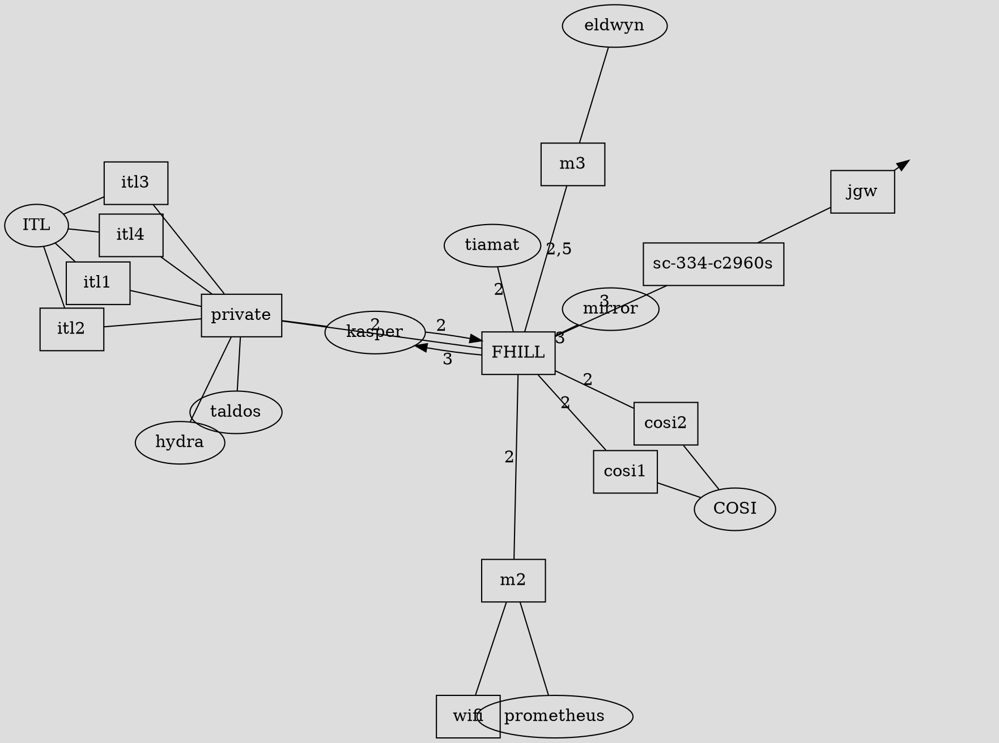
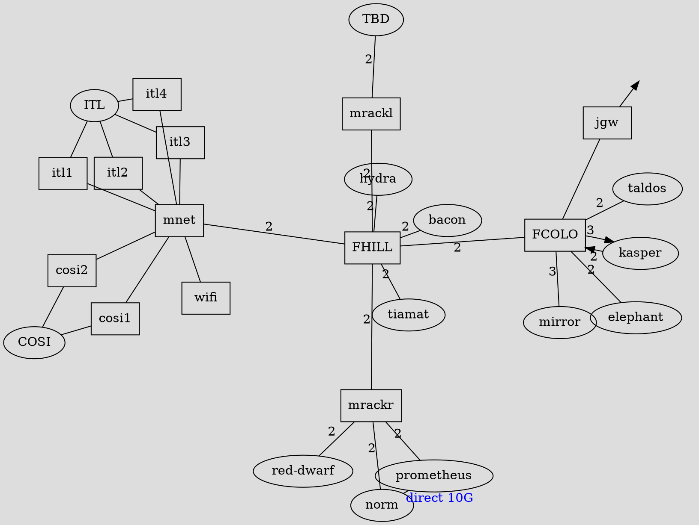

# Topology

_updated: Jan 15th 2023_

**Legend: Edges**

| Style  | Description                   |
|--------|-------------------------------|
| Red    | 40 gigabit single mode fiber  |
| Orange | 10 gigabit single mode fiber  |
| Black  | 1 gigabit copper ethernet     |
| Green  | Patch Panel (speed varies by patch health) |
| Blue   | Special (read label by label) |
| Gray   | Controlled by OIT             |

Numeric labels on edges represent [VLANs](#vlans).

**Legend: Ovals**

| style  | description                |
|--------|----------------------------|
| Red    | Host                       |
| Green  | Room                       |
| Gray   | Controlled by OIT          |
| Green  | Patch Panel                |

**Legend: Boxes (switches)**

| style  | description                |
|--------|----------------------------|
| Purple | Aggregation (fiber) Switch |
| Blue   | Managed Switch             |
| Black  | Unmanaged Switch           |

If you have trouble distinguishing colors, you can read the source code.

## Current Topology

_updated: December 17th, 2023_

## Desired Topology

_updated: Mar 2nd 2023_

