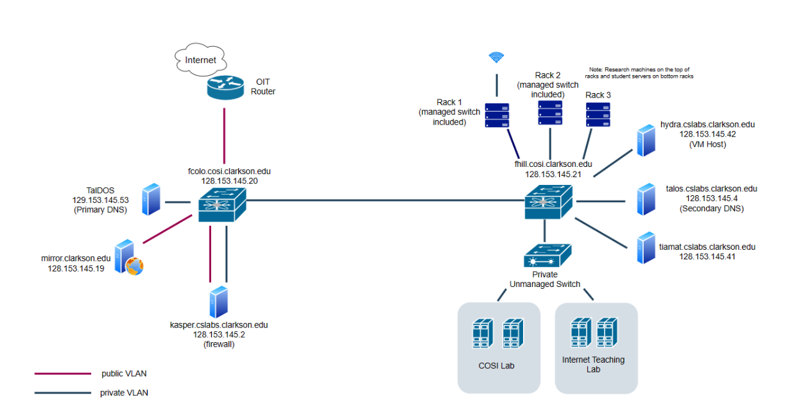

# Topology

_updated: Jul 25th, 2024_

# Current Topology

## Notes
Servers like Mirror and Kasper that should ideally be up around the clock were placed in COLO because it is backed by a generator. There were a couple of incidents where the power went out on the hill campus that made COSI re-evaluate placement. If you want to know more about why the network changed you can take a look [here](https://carlone-capstone.cosi.clarkson.edu/).

There is room to add more [VLANs](vlans.md) to the network. Any new VLAN that needs internet connection can use the same port as the private VLAN that connects the two primary fiber switches.  
